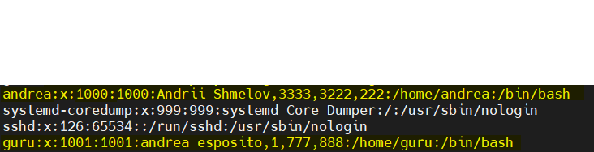
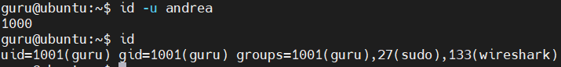
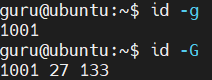
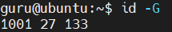
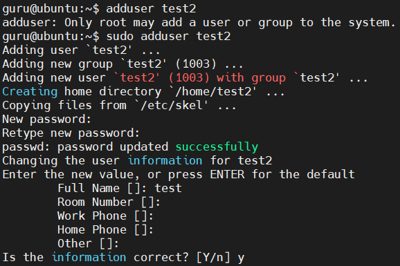
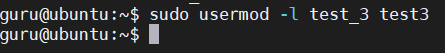
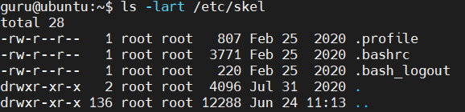
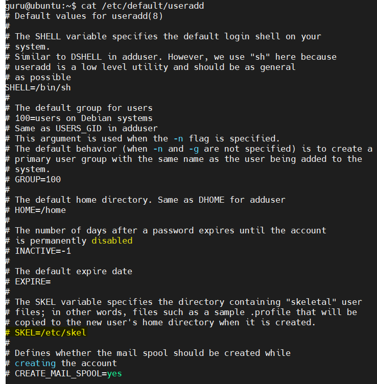
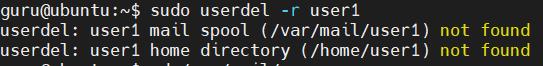
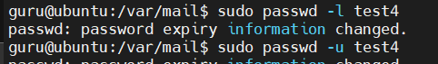

Task assignment.
1) Analyze the structure of the /etc/passwd and /etc/group file,
   what fields are present in it, what users exist on the system?
   Specify several pseudo-users, how to define them?
   
>guru@ubuntu:~$ cat /etc/passwd

>guru@ubuntu:~$ cat /etc/group

2) What are the uid ranges? What is UID? How to define it?
   

3) What is GID? How to define it?

4) How to determine belonging of user to the specific group?
   

5) What are the commands for adding a user to the system?
   What are the basic parameters required to create a user?
   
>guru@ubuntu:~$ sudo useradd test1
> 
>guru@ubuntu:~$ sudo passwd test1
>
>guru@ubuntu:~$ sudo adduser test2

6) How do I change the name (account name) of an existing user?

7) What is skell_dir?

 

What is its structure?

   
8) How to remove a user from the system (including his mailbox)?
   

9) What commands and keys should be used to lock and unlock a user account?
   

10) How to remove a user's password and provide him 
    with a password-free login for subsequent password change?
11) Display the extended format of information about the directory,
    tell about the information columns displayed on the terminal.
12) What access rights exist and for whom (i. e., describe the main roles)?
    Briefly describe the acronym for access rights.
13) What is the sequence of defining the relationship between the file and the user?
14) What commands are used to change the owner of a file (directory),
    as well as the mode of access to the file? Give examples, demonstrate on the terminal.
15) What is an example of octal representation of access rights? Describe the umask command.
16) Give definitions of sticky bits and mechanism of identifier substitution.
    Give an example of files and directories with these attributes.
17) What file attributes should be present in the command script?