1. How many states could has a process in Linux?
   
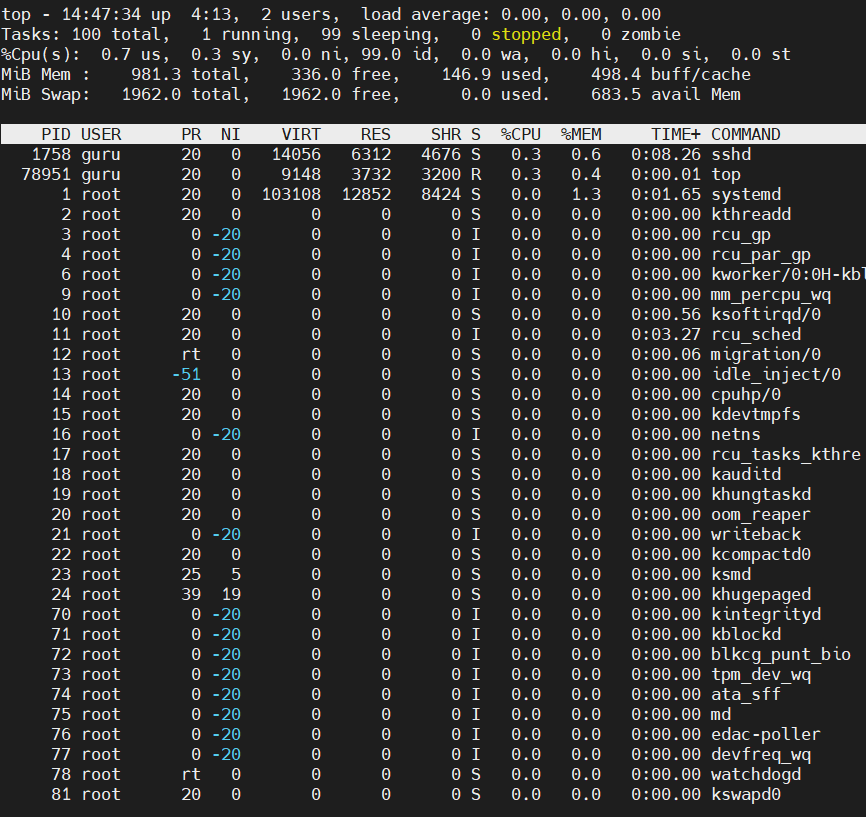

2. Examine the pstree command.
   
>guru@server1:~# pstree
>
>guru@server1:~# pstree -p
> 
>guru@server1:~# pstree -g

   Make output (highlight) the chain (ancestors) of the current process.

>guru@server1:~# pstree -a | less

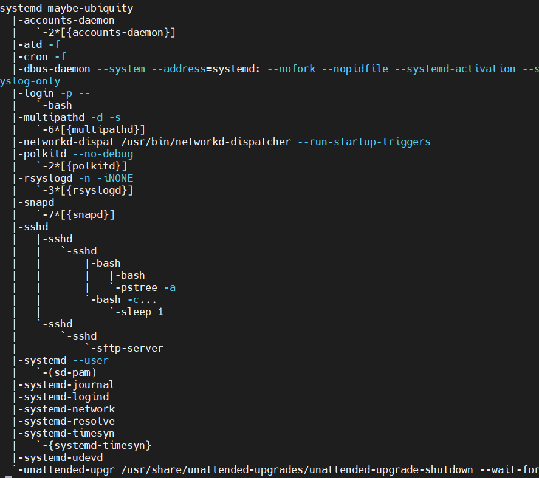

3. What is a proc file system?

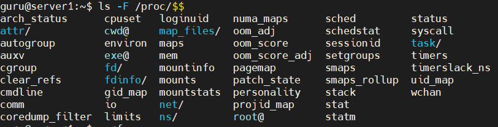

4. Print information about the processor (its type, supported technologies, etc.).
 
>guru@server1:~# lscpu
  
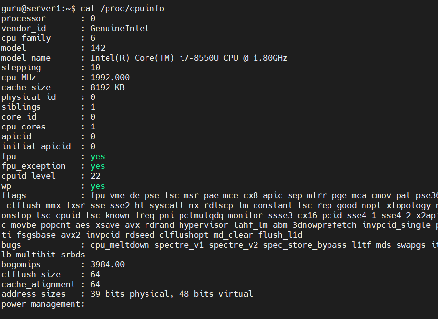

5. Use the ps command to get information about the process.
   The information should be as follows: the owner of the process,
   the arguments with which the process was launched for execution,
   the group owner of this process, etc.    
   
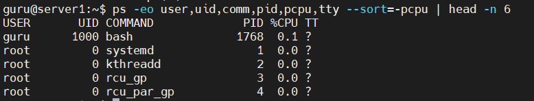

6. How to define kernel processes and user processes?
 
kernel processes
>guru@server1:~# ps --ppid=2 --pid=2

user processes
>guru@server1:~# ps -N --ppid=2 --pid=2

kernel processes
>guru@server1:~# pstree 2

user processes
>guru@server1:~# pstree

7. Print the list of processes to the terminal.
   Briefly describe the statuses of the processes.
   What condition are they in, or can they be arriving in?
   
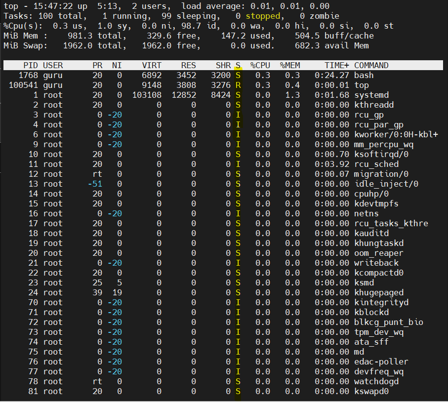

8. Display only the processes of a specific user.

>guru@server1:~# ps -u guru
   
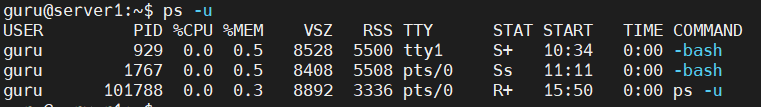

9. What utilities can be used to analyze existing running tasks 
   (by analyzing the help for the ps command)?
   
> guru@server1:~# ps -a
>
> guru@server1:~# ps -A <all proccess>
> 
> guru@server1:~# ps -d
> guru@server1:~# ps -p PID

10. What information does top command display?
    
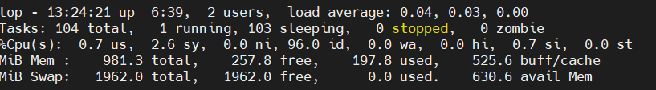

12. Display the processes of the specific user using the top command.
    
> guru@server1:~# top -u guru

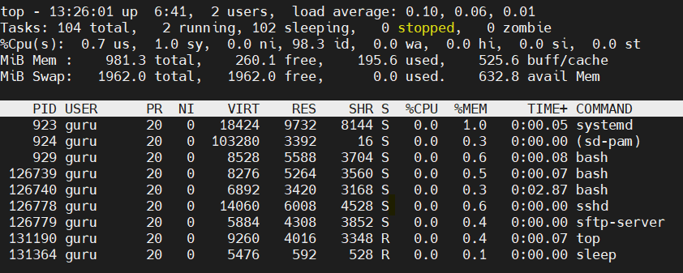

12. What interactive commands can be used to control the top command?
    Give a couple of examples.

> guru@server1:~# top -b
> 
> guru@server1:~# top -c
> 
> guru@server1:~# top -p PID

13. Sort the contents of the processes window using various parameters
    (for example, the amount of processor time taken up, etc.)
    
> guru@server1:~# htop

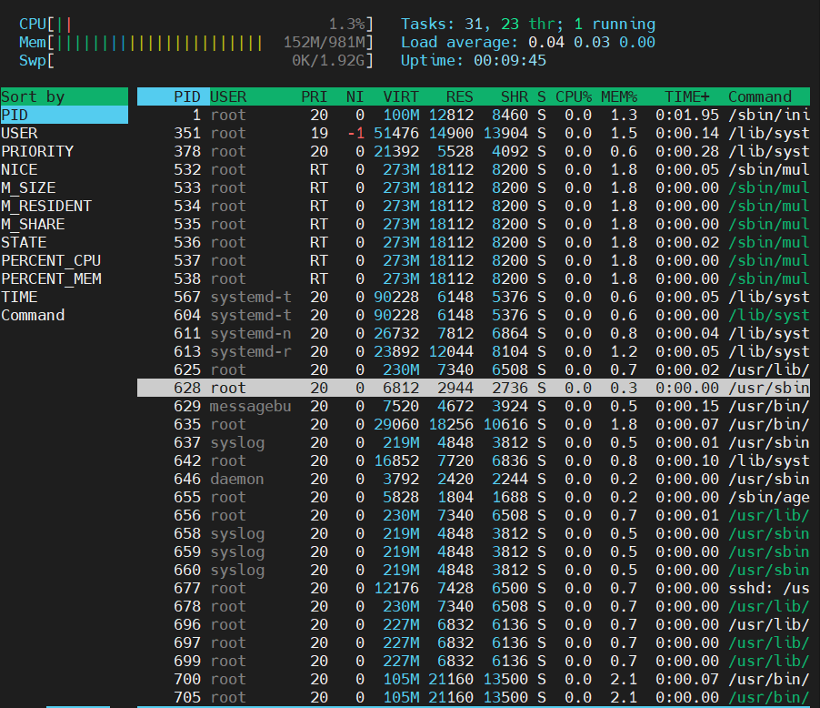

14. Concept of priority, what commands are used to set priority?
    

15. Can I change the priority of a process using the top command? If so, how? 

> guru@server1:~# top
> 
> Then hit "r" and enter the PID of a processe

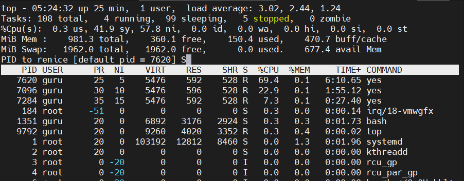

16. Examine the kill command. How to send with the kill command
process control signal? Give an example of commonly used signals.
    
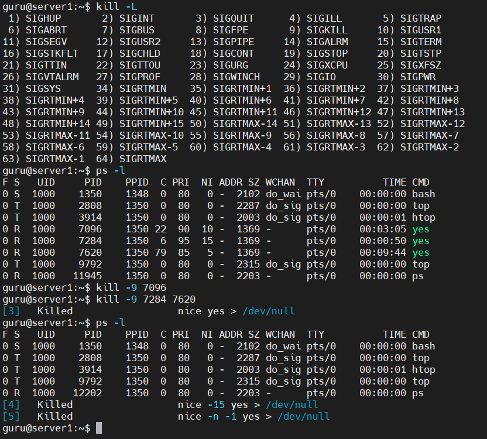

17. Commands jobs, fg, bg, nohup. What are they for?
    Use the sleep, yes command to demonstrate the process control mechanism with fg, bg.
    
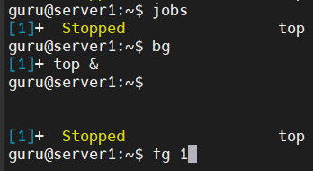

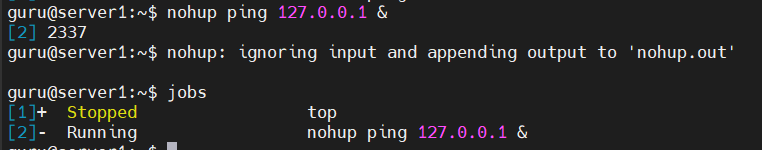